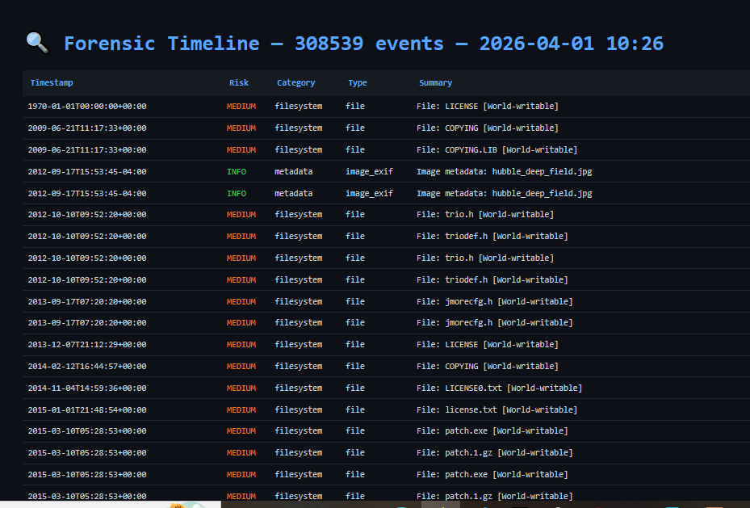

# 🔬 Digital Forensics Toolkit — Python-Based Incident Response & Evidence Collection


> A modular, Python-based digital forensics toolkit that automates evidence collection for incident response — scanning filesystems for suspicious files, extracting browser history, recovering EXIF/GPS metadata, carving deleted files from disk images, and generating a unified forensic timeline with HTML and CSV reports.

---

## Screenshot



---

## 📌 Table of Contents

- [Overview](#overview)
- [Features](#features)
- [How It Works](#how-it-works)
- [Modules](#modules)
- [Installation](#installation)
- [Usage](#usage)
- [Sample Output](#sample-output)
- [Output Files](#output-files)
- [Project Structure](#project-structure)
- [Legal Disclaimer](#legal-disclaimer)
- [Skills Demonstrated](#skills-demonstrated)
- [Future Improvements](#future-improvements)
- [Author](#author)

---

## Overview

The Digital Forensics Toolkit automates the early stages of a forensic investigation — the most time-critical phase of any incident response. It is modular by design, meaning each component can be run independently or all together using `--all`.

It is built to assist with:
- **Incident Response** — rapid triage of a compromised system
- **Evidence Collection** — hashing and preserving files with chain-of-custody records
- **Dead Disk Analysis** — carving deleted files from raw disk images
- **Browser Forensics** — recovering browsing history and suspicious downloads
- **Timeline Reconstruction** — building a unified picture of what happened and when

---

## Features

| Feature | Detail |
|---|---|
| 🗂️ Evidence Collection | Copies files to a safe output dir with MD5 + SHA256 hashes |
| 📋 Chain of Custody | Auto-generates a `manifest.csv` for every collected file |
| 🖥️ Filesystem Analysis | Detects SUID/SGID bits, world-writable files, hidden executables |
| 🌐 Browser History | Extracts Chrome, Firefox, and Edge history and downloads via SQLite |
| 📷 EXIF / Metadata | Recovers GPS coordinates, camera info, and author data from images and PDFs |
| 💾 File Carving | Recovers deleted files from raw disk images using magic byte signatures |
| 📅 Timeline Generation | Unified forensic timeline sorted by timestamp — HTML and CSV |
| 🧠 Memory Strings | Extracts readable strings from memory dump files |
| 📊 Case Summary | JSON report with artifact counts by category and risk level |
| 🔴 Risk Flagging | Artifacts rated INFO / MEDIUM / HIGH based on forensic significance |

---

## How It Works

```
┌─────────────────────────────────────────────┐
│              ForensicsToolkit                │  Master orchestrator
└──────────────────┬──────────────────────────┘
                   │ runs selected modules
       ┌───────────┼───────────────────┐
       ▼           ▼                   ▼
┌────────────┐ ┌──────────────┐ ┌───────────────┐
│ Filesystem │ │   Browser    │ │   Metadata    │
│ Analyzer   │ │   History    │ │   Extractor   │
│            │ │   Extractor  │ │               │
└─────┬──────┘ └──────┬───────┘ └──────┬────────┘
      │               │                │
      └───────────────┼────────────────┘
                      │ ForensicArtifact objects
                      ▼
             ┌─────────────────┐
             │    Evidence     │  Hashes + copies files
             │    Collector    │  Writes manifest.csv
             └────────┬────────┘
                      │
                      ▼
             ┌─────────────────┐
             │    Timeline     │  Sorts all events by timestamp
             │    Generator    │  → timeline.html + timeline.csv
             └────────┬────────┘
                      │
                      ▼
             ┌─────────────────┐
             │  Case Summary   │  → case_summary.json
             └─────────────────┘
```

---

## Modules

### 🗂️ EvidenceCollector
Copies files to a safe output directory and computes **MD5 and SHA256** hashes for each one. Writes a `manifest.csv` as a chain-of-custody record — proving that evidence was not altered after collection.

---

### 🖥️ FileSystemAnalyzer
Walks a directory tree and flags suspicious files based on:

| Flag | Severity | Description |
|---|---|---|
| SUID / SGID bit set | HIGH | File runs with elevated privileges — common attacker trick |
| Hidden executable | HIGH | e.g. `.malware.sh` — hidden file with dangerous extension |
| Executable in `/tmp` or `C:\Windows\Temp` | HIGH | Common malware staging location |
| World-writable file | MEDIUM | Any user can modify the file |
| Modified within last hour | INFO | Recently touched — relevant during active incident |

---

### 🌐 BrowserHistoryExtractor
Reads the **SQLite databases** that Chrome, Firefox, and Edge use to store browsing data. Works on Windows, Linux, and macOS by automatically detecting the correct profile path.

Extracts:
- Full browsing history (URL, title, visit count, last visit time)
- Download history (file path, source URL, size, timestamps)
- Flags downloads of suspicious file types (`.exe`, `.ps1`, `.bat`, etc.)

---

### 📷 MetadataExtractor
Pulls hidden metadata from image and document files:

- **Images** — EXIF data including camera model, software, datetime, and GPS coordinates. GPS findings are flagged HIGH risk.
- **PDFs** — Author, Creator, Producer, CreationDate, ModDate, Title fields extracted via byte-pattern parsing.

---

### 💾 FileCarver
Scans raw disk image files byte-by-byte and recovers deleted files using **magic byte signatures** (file headers and footers):

| File Type | Header Signature | Extension |
|---|---|---|
| JPEG | `\xff\xd8\xff` | `.jpg` |
| PNG | `\x89PNG\r\n\x1a\n` | `.png` |
| PDF | `%PDF-` | `.pdf` |
| ZIP | `PK\x03\x04` | `.zip` |
| EXE | `MZ` | `.exe` |
| SQLite | `SQLite format 3` | `.db` |
| MP4 | `\x00\x00\x00\x18ftyp` | `.mp4` |

---

### 📅 TimelineGenerator
Aggregates all `ForensicArtifact` objects from every module, sorts them by timestamp, and produces:
- `timeline.csv` — for import into spreadsheet or SIEM tools
- `timeline.html` — dark-themed, colour-coded interactive report

---

### 🧠 Memory String Extraction
Reads a raw memory dump file and extracts all **printable ASCII strings** of 6+ characters — useful for recovering URLs, commands, credentials, and filenames from a captured memory image.

---

## Installation

### Required (standard library only for core features)
```bash
git clone https://github.com/Don-cybertech/07_forensics_toolkit.git
cd 07_forensics_toolkit
python3 --version  # requires 3.8+
```

### Optional dependencies (for full functionality)
```bash
pip install Pillow        # EXIF extraction from images
pip install pytsk3        # Advanced disk image parsing
```

> The toolkit runs without these — it gracefully skips features that require missing libraries.

---

## Usage

### Run all modules on a directory
```bash
python3 forensics_toolkit.py --dir /path/to/evidence --all --output ./case_001
```

### Filesystem scan only
```bash
python3 forensics_toolkit.py --dir /home/user --filesystem --output ./case_001
```

### Browser history extraction
```bash
python3 forensics_toolkit.py --browser --output ./case_001
```

### EXIF and document metadata
```bash
python3 forensics_toolkit.py --dir /home/user/Documents --metadata --output ./case_001
```

### File carving from a disk image
```bash
python3 forensics_toolkit.py --image disk.img --carve --output ./case_001
```

### Memory string extraction
```bash
python3 forensics_toolkit.py --memory dump.mem --strings --output ./case_001
```

### Generate timeline after analysis
```bash
python3 forensics_toolkit.py --dir /evidence --all --timeline --output ./case_001
```

### CLI Reference

| Argument | Description |
|---|---|
| `--dir PATH` | Root directory to analyze |
| `--image FILE` | Raw disk image for file carving |
| `--memory FILE` | Memory dump for string extraction |
| `--output DIR` | Output directory for all case files (default: `forensic_output`) |
| `--all` | Run all available modules |
| `--filesystem` | Run filesystem scan |
| `--browser` | Extract browser history |
| `--metadata` | Extract EXIF and document metadata |
| `--carve` | Carve files from disk image |
| `--timeline` | Generate forensic timeline |
| `--strings` | Extract strings from memory dump |

---

## Sample Output

```
2026-03-31 11:00:01 [INFO] == Filesystem Analysis ==
2026-03-31 11:00:03 [INFO]   1,842 files scanned, 7 high-risk items

2026-03-31 11:00:03 [INFO] == Browser History Extraction ==
2026-03-31 11:00:04 [INFO]   312 browser artifacts collected

2026-03-31 11:00:04 [INFO] == Metadata Extraction ==
2026-03-31 11:00:06 [INFO]   14 metadata records extracted

2026-03-31 11:00:06 [INFO] == Timeline Generation ==
2026-03-31 11:00:06 [INFO] Timeline CSV → forensic_output/timeline.csv
2026-03-31 11:00:06 [INFO] Timeline HTML → forensic_output/timeline.html

════════════════════════════════════════════════════════════
  FORENSIC ANALYSIS COMPLETE
════════════════════════════════════════════════════════════
  Output dir      : forensic_output
  Total artifacts : 2,168
  High risk items : 7
  Categories      : {'filesystem': 1842, 'browser': 312, 'metadata': 14}
════════════════════════════════════════════════════════════
```

---

## Output Files

| File | Description |
|---|---|
| `manifest.csv` | Chain-of-custody record with MD5 + SHA256 for every collected file |
| `timeline.html` | Dark-themed, colour-coded forensic timeline |
| `timeline.csv` | Timeline in CSV format for spreadsheet or SIEM import |
| `case_summary.json` | JSON summary with artifact counts and risk breakdown |
| `carved/` | Directory containing all files recovered from disk image |
| `carved.json` | Index of carved files with offsets, sizes, and MD5 hashes |
| `memory_strings.txt` | Printable strings extracted from memory dump |
| `collected/` | Evidence files copied for safe analysis |

---

## Project Structure

```
07_forensics_toolkit/
├── forensics_toolkit.py     # Entire toolkit (single file)
├── forensic_output/         # Case output (auto-created)
│   ├── manifest.csv
│   ├── timeline.html
│   ├── timeline.csv
│   ├── case_summary.json
│   ├── carved/
│   └── collected/
├── report_screenshot.png    # Screenshot of the HTML timeline
└── README.md
```

---

## Legal Disclaimer

> WARNING: This toolkit is for authorised forensic investigations and
> educational purposes only. Only run it against systems and data you
> own or have explicit written permission to analyse.
> Unauthorised access to computer systems is illegal.

---

## Skills Demonstrated

- **Digital Forensics** — Evidence hashing, chain of custody, file carving, timeline reconstruction
- **SQLite Querying** — Extracting browser history directly from Chrome/Firefox/Edge databases
- **Binary Analysis** — Magic byte signature matching for file type identification and carving
- **EXIF Parsing** — GPS and camera metadata extraction using Pillow
- **Filesystem Analysis** — SUID/SGID detection, permission analysis, suspicious file flagging
- **Memory Forensics** — String extraction from raw memory dumps
- **OOP Design** — Seven well-scoped classes with clean separation of responsibilities
- **Cross-Platform Support** — Windows, Linux, and macOS browser path detection
- **Report Generation** — HTML timeline and JSON case summary generation

---

## Future Improvements

- [ ] Windows Registry artifact extraction
- [ ] Network connection and `netstat` snapshot collection
- [ ] YARA rule scanning for malware signatures
- [ ] Automated report PDF export
- [ ] Prefetch and MFT ($MFT) parsing on Windows
- [ ] Integration with VirusTotal API for hash lookups
- [ ] Graphical timeline visualisation

---

## Author

**Egwu Donatus Achema**

— Cybersecurity Analyst| Python Developer 

GitHub:[@Don-cybertech(https://github.com/Don-cybertech)]

LinkedIn: (https://www.linkedin.com/in/egwu-donatus-achema-8a9251378/)

Gmail:(donatusachema@gmail.com)

Part of: [Cybersecurity Portfolio(https://github.com/Don-cybertech/cybersecurity_portfolio)]

> *"Every digital action leaves a trace." — Forensics Principle*

---

## License

This project is licensed under the **MIT License** — free to use, modify, and share with attribution.
